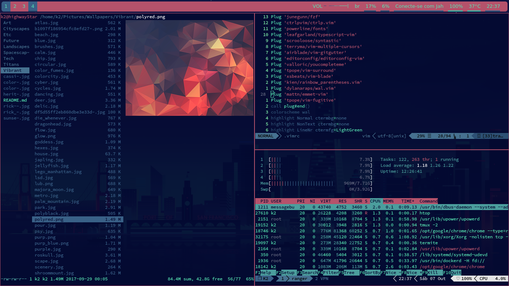

# These dotfiles are free to be copied and improved as willing
---
## List of softwares used currently:
- [Ranger](https://github.com/ranger/ranger)
- [i3wm](i3wm.org)
- [Polybar](https://github.com/jaagr/polybar)
- [bumblebee-status](https://github.com/tobi-wan-kenobi/bumblebee-status)
- [VIM](https://github.com/vim/vim)
- [Zsh/Oh-my-zsh](https://github.com/robbyrussell/oh-my-zsh)
- [Tmux](https://github.com/tmux/tmux/wiki)
- [pywal (to generate color pallettes based on desktop background)](https://github.com/dylanaraps/pywal)
- Also a Xsession file with settings to restore cached colorscheme generated by pywal

