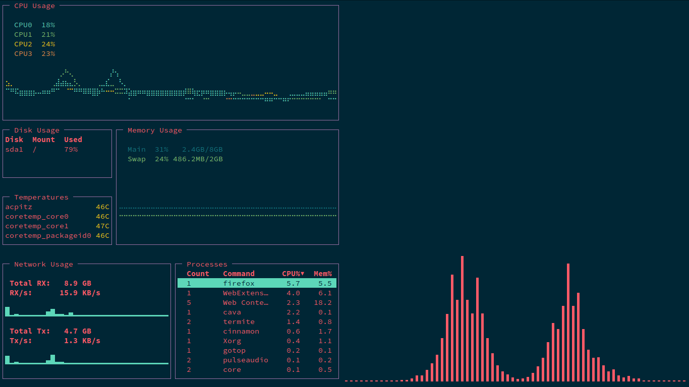

# THESE DOTFILES ARE PURE FREEDOM, USE THEM.
---
## List of softwares covered:
- [Ranger](https://github.com/ranger/ranger)
- [i3wm](i3wm.org) - Using fork i3-gaps from [airblader/i3](https://github.com/Airblader/i3)
- [Polybar](https://github.com/jaagr/polybar)  
- [bumblebee-status](https://github.com/tobi-wan-kenobi/bumblebee-status) 
- [VIM](https://github.com/vim/vim) hic sunt dracones
- [Zsh/Oh-my-zsh](https://github.com/robbyrussell/oh-my-zsh) .zshrc file uses antigen stuff btw. 
- [Tmux](https://github.com/tmux/tmux/wiki) !DEPRECATED! who needs this with i3 I dunno
- [pywal (to generate color pallettes based on desktop background)](https://github.com/dylanaraps/pywal)
- Also a Xsession file with settings to restore cached colorscheme generated by pywal
# Cansei das screenshots velhas, menos é mais. 
# 

No GUI, no mouse, no nothing, no problem.
